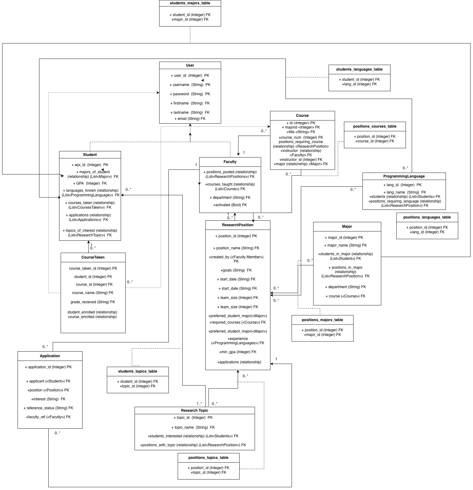
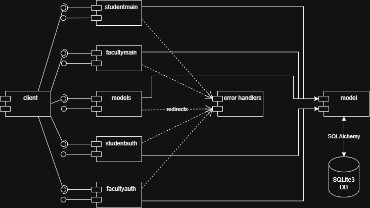
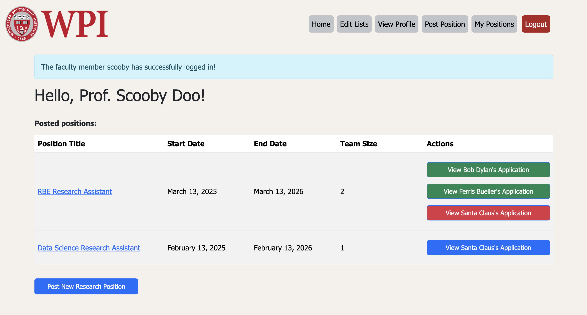
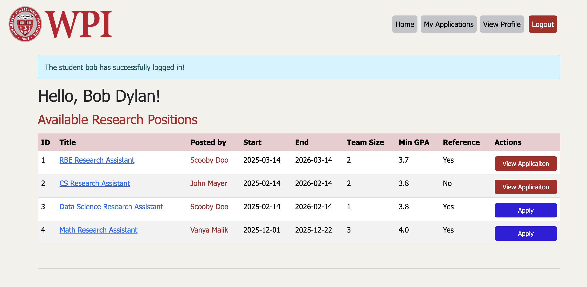
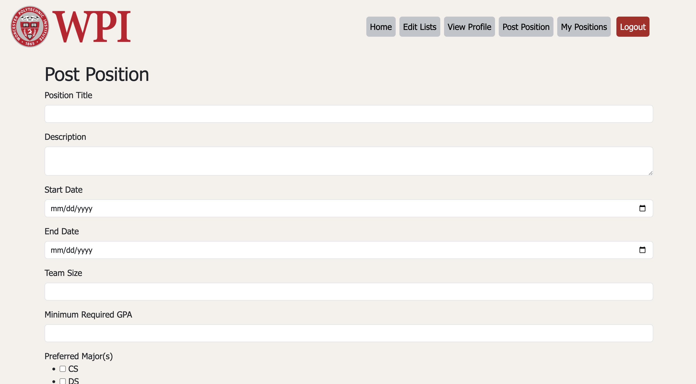
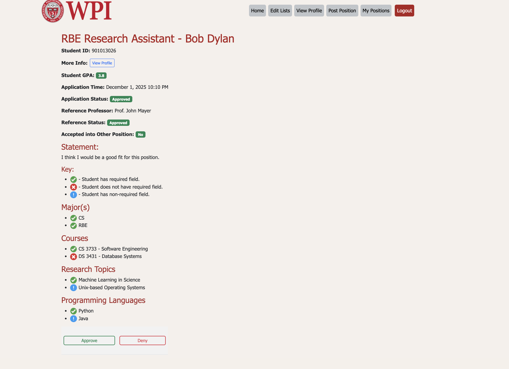
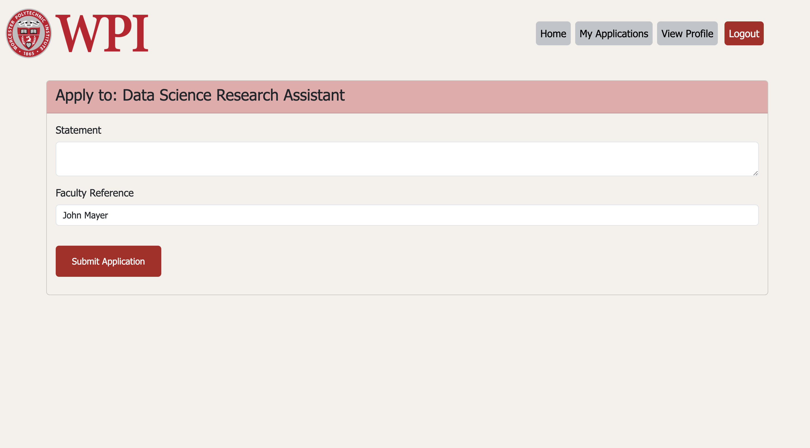

# Project Design Document

## Team CodeClique

---

Prepared by:

- `Vanya Malik`, `WPI`
- `Ritvik Garg`, `WPI`
- `Elliot Ghidali`, `WPI`
- `Pranav Santhosh`,`WPI`

---

**Course** : CS 3733 - Software Engineering

**Instructor**: Sakire Arslan Ay

---

## Table of Contents

- [1. Introduction](#1-introduction)
- [2. Software Design](#2-software-design)
- [2.1 Database Model](#21-model)
- [2.2 Modules and Interfaces](#22-modules-and-interfaces)
- [2.2.1 Overview](#221-overview)
- [2.2.2 Interfaces](#222-interfaces)
- [2.3 User Interface Design](#23-view-and-user-interface-design)
- [3. References](#3-references)

### Document Revision History

| Name        | Date       | Changes                         | Version |
| ----------- | ---------- | ------------------------------- | ------- |
| Revision 1  | 2025-11-14 | Initial draft                   | 1.0     |
| Revision 2  | 2025-11-14 | Added UML component diagram     | 1.1     |
| Revision 3  | 2025-11-14 | Added images and guideline text | 1.2     |
| Revision 4  | 2025-11-14 | Added project title             | 1.3     |
| Revision 5  | 2025-11-14 | Added introduction              | 1.4     |
| Revision 6  | 2025-11-14 | Fine-tuning                     | 1.5     |
| Revision 7  | 2025-11-21 | added new facultymain routes    | 2.0     |
| Revision 8  | 2025-11-21 | Updating 2.2.1                  | 2.1     |
| Revision 9  | 2025-11-21 | Updating 2.1                    | 2.2     |
| Revision 10 | 2025-11-23 | Updating routes                 | 2.3     |
| Revision 11 | 2025-11-25 | Finalizing routes               | 3.0     |
| Revision 12 | 2025-12-01 | Removing old routes             | 3.1     |

# 1. Introduction

The purpose of this document is to explain how our research matching system is built and how its parts work together. It shows the design of the database, the main modules of the system, and all the routes students and faculty will use. This document shows a clearer outlook of how the system is designed and a cleaner explanation of how each feature works. We also added improved UI sketches that show what the main pages will look like for both students and faculty. Overall, this revision makes the design easier to understand and closer to what the final system will actually look like.

# 2. Software Design

## 2.1 Database Model

- User model: contains information about a general user, such as:
- Student model: contains the information that is specific to a student user (major, research interests, etc.)
- Faculty model: contains the information that is specific to a faculty user (i.e. research positions)
- Course model: contains information for a specific course
- Major model: contains information for a particular major.
- ResearchTopic model: represents specific topic of research and will be related to students as well as positions
- ResearchPosition model: contains information about a research position; will be posted by a faculty member and is related to students through the Application model
- CourseTaken model: stores the information related to a course a student has taken, most notably the grade earned, which is not contained in the original Course model.
- ProgrammingLanguages model: represents various programming languages and can be linked to a student as well as a position, since positions have a recommended experience section.
- Application model: represents an Application created by a Student. Is related to a Research Position as well as a Faculty Member if a reference is required.

## 2.2 Modules and Interfaces

### 2.2.1 Overview

- StudentMain: handles all other functionality for students
- FacultyMain: handles all other functionality for faculty
- Models: handles all models and model relationships
- StudentAuth: handles all the login/logout functionality for students
- FacultyAuth: handles all the login/logout functionality for faculty
- Errors: handles all the erroring functionality

### 2.2.2 Interfaces

#### 2.2.2.1 \ facultyauth Routes

|     | Methods   | URL Path                   | Description                                                                      |
| :-- | :-------- | :------------------------- | :------------------------------------------------------------------------------- |
| 1.  | GET, POST | /faculty/activate          | Allow new faculty users to activate their account and register their credentials |
| 2.  | POST      | /faculty/activate/verify   | Allow new faculty users to activate their account via email                      |
| 3.  | POST      | /faculty/activate/register | Allow new faculty users to register their credentials and verify their access    |
| 4.  | GET, POST | /faculty/login             | Allow registered faculty to sign in to their account                             |
| 5.  | POST      | /faculty/logout            | Allow current logged in faculty user to log out                                  |

#### 2.2.2.2 \ studentauth Routes

|     | Methods   | URL Path          | Description                                                                                                      |
| :-- | :-------- | :---------------- | :--------------------------------------------------------------------------------------------------------------- |
| 1.  | GET, POST | /student/register | Allow new student users to enter their credentials and create an account for the application                     |
| 2.  | GET, POST | /student/login    | Allow registered users to sign into their account using username and password. Will redirect to main index page. |
| 3.  | POST      | /student/logout   | Allow current logged in users to sign out of their account. Will be redirected to login page                     |

#### 2.2.2.3 \ facultymain Routes

|     | Methods   | URL Path                                        | Description                                                      |
| :-- | :-------- | :---------------------------------------------- | :--------------------------------------------------------------- |
| 1.  | GET       | /faculty/requests                               | Displays pending recommendation requests                         |
| 2.  | POST      | /faculty/requests/<application_id>/accept       | Accepts pending recommendation request                           |
| 3.  | POST      | /faculty/requests/<application_id>/deny         | Deny pending recommendation request                              |
| 4.  | GET, POST | /faculty/edit-lists                             | Edit Research Topic and Programming Language lists               |
| 5.  | POST      | /faculty/edit-lists/delete                      | Delete from topic and language lists                             |
| 6.  | POST      | /faculty/edit-lists/add                         | add to topic and language lists                                  |
| 7.  | GET       | /faculty/profile                                | Allow user to view their profile                                 |
| 8.  | GET, POST | /faculty/profile/edit                           | allow user to edit their profile                                 |
| 9.  | GET       | /position/mypositions                           | View current positions belonging to the logged in faculty member |
| 10. | POST      | /position/<position_id>/<application_id>        | View a student's request for a position                          |
| 11. | POST      | /position/<position_id>/<application_id>/accept | Accept a student's request for a position                        |
| 12. | POST      | /position/<position_id>/<application_id>/deny   | Deny a student's request for a position                          |
| 13. | GET, POST | /faculty/postposition                           | Create new research position inputting required information      |
| 14. | GET, POST | /course/create                                  | Create a new course                                              |
| 15. | GET       | /faculty/<student_id>/profile                   | View Selected students profile details                           |

#### 2.2.2.4 \ studentmain Routes

|     | Methods   | URL Path                                | Description                                     |
| :-- | :-------- | :-------------------------------------- | :---------------------------------------------- |
| 1.  | GET       | /welcome                                | Landing page                                    |
| 2.  | GET       | /index                                  | Student dashboard                               |
| 3.  | GET       | /positions/recommended                  | Shows recommended positions                     |
| 4.  | GET       | /positions/<position_id>                | View detailed info of a position                |
| 5.  | GET, POST | /positions/<position_id>/apply          | Apply to a research position                    |
| 6.  | GET, POST | /course/create                          | Add a course                                    |
| 7.  | POST      | /course/<course_id>/delete              | Delete a course the logged in student has taken |
| 8.  | GET       | /applications                           | View all applications and the status            |
| 9.  | GET       | /applications/<application_id>/view     | View details of a specific application          |
| 10. | POST      | /applications/<application_id>/withdraw | Withdraw a pending application                  |
| 11. | GET       | /student/profile                        | View student profile                            |
| 12. | GET, POST | /student/editprofile                    | Edit student profile                            |

### 2.3 User Interface Design

UI sketches are provided for the following pages:

- Faculty main page
- Student main page (show how you will display "all positions" vs "recommended positions")
- Faculty creating a position
- Faculty accepting /rejecting an application
- Student applying a position

  
  
  
  

---
